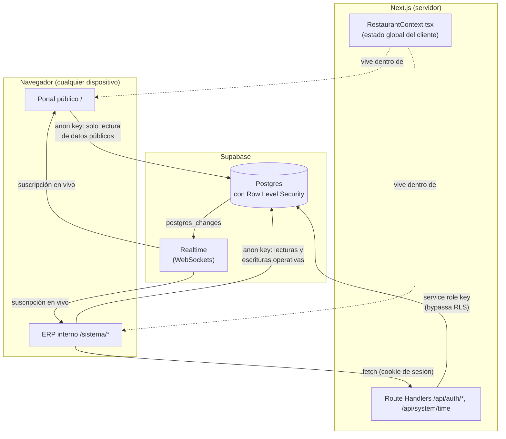
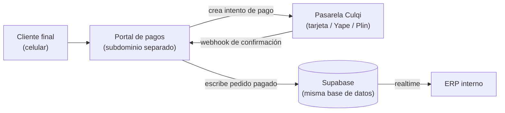

# Mapa de Arquitectura — ÉTERRA OS

Cómo se conectan las piezas del sistema hoy (Fase 1 completa). Léase junto a
`CLAUDE.md`.

## Vista general

## Puntos clave

- **Dos llaves de Supabase, dos niveles de confianza:**
  - `anon key` (`src/lib/supabase.ts`): pública, vive en el navegador de
    cualquiera. Protegida solo por RLS (ver `docs/database-schema.md` y
    `CLAUDE.md` sección 5).
  - `service role key` (`src/lib/supabase-service.ts`): secreta, **solo** en
    las Route Handlers del servidor. Nunca debe llegar al navegador.

- **La autenticación siempre pasa por el servidor.** El navegador nunca
  compara contraseñas ni PINs — llama a `/api/auth/login` o
  `/api/auth/identify`, que usan la service role key + bcrypt.

- **El realtime NO pasa por el servidor de Next.js.** El navegador se conecta
  directo a Supabase Realtime con la anon key — por eso cualquier cambio en
  una tabla (nueva orden, mesa actualizada) se refleja al instante en todos
  los dispositivos conectados, sin que el servidor tenga que reenviar nada.

- **`RestaurantContext.tsx`** es el único punto donde el cliente habla con
  Supabase para datos operativos (mesas, pedidos, carta) — ningún componente
  llama a Supabase directamente. Esto es lo que hace viable dividirlo en una
  capa de servicios más adelante (Fase 2) sin tener que tocar 20 archivos.

## Futuro: Fase 3 (portal de pagos)

El portal de pagos comparte la misma base de datos (Supabase) que el ERP, así
que un pedido pagado por un cliente aparece en la cocina/caja en tiempo real,
sin integración adicional.
